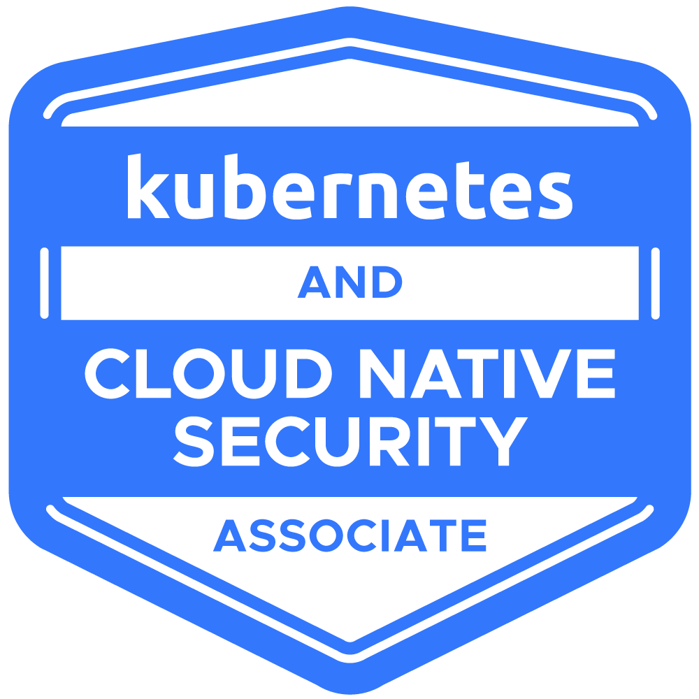

# Kubernetes and Cloud Native Security Associate (KCSA) in 2024

Kubernetes and Cloud Native Security Associate (KCSA) - The KCSA is a pre-professional certification designed for candidates interested in advancing to the professional level through a demonstrated understanding of foundational knowledge and skills of security technologies in the cloud native ecosystem.

  

# Certification

- Duration of Exam: **90 minutes**.
- Number of questions: **60 test tasks with multiple choice exam**.
- Passing score: **75%** or above.
- Certification validity: **2 years**.
- Cost: **$250 USD**.
- Exam Eligibility: **12 Month**, with a free retake within this year.
- [The official website with certification](https://training.linuxfoundation.org/certification/kubernetes-and-cloud-native-security-associate-kcsa/)
- [CNCF Exam Curriculum repository](https://github.com/cncf/curriculum/)
- [Tips & Important Instructions: KCSA](https://docs.linuxfoundation.org/tc-docs/certification/important-instructions-mc)
- [Candidate Handbook](https://docs.linuxfoundation.org/tc-docs/certification/lf-handbook2)
- [Verify Certification](https://training.linuxfoundation.org/certification/verify/)

# Structure of certification

## Overview of Cloud Native Security - 14%

### The 4Cs of Cloud Native Security

### Cloud Provider and Infrastructure Security

### Controls and Frameworks

### Isolation Techniques

### Artifact Repository and Image Security

### Workload and Application Code Security

## Kubernetes Cluster Component Security - 22%

### API Server

### Controller Manager

### Scheduler

### Kubelet

### Container Runtime

### KubeProxy

### Pod

### Etcd

### Container Networking

### Client Security

### Storage

## Kubernetes Security Fundamentals - 22%

### Pod Security Standards

### Pod Security Admissions

### Authentication

### Authorization

### Secrets

### Isolation and Segmentation

### Audit Logging

### Network Policy

## Kubernetes Threat Model - 16%

### Kubernetes Trust Boundaries and Data Flow

### Persistence

### Denial of Service

### Malicious Code Execution and Compromised Applications in Containers

### Attacker on the Network

### Access to Sensitive Data

### Privilege Escalation

## Platform Security - 16%

### Supply Chain Security

### Image Repository

### Observability

### Service Mesh

### PKI

### Connectivity

### Admission Control

## Compliance and Security Frameworks - 10%

### Compliance Frameworks

### Threat Modelling Frameworks

### Supply Chain Compliance

### Automation and Tooling

# Additional useful material

## Articles

1. [Handbook](https://www.cncf.io/certification/candidate-handbook)

## Books

- None

## Videos

- None

# Authors

Created and maintained by:
- [Vitalii Natarov](https://github.com/SebastianUA). An email: [vitaliy.natarov@yahoo.com](vitaliy.natarov@yahoo.com).

# License
Apache 2 Licensed. See [LICENSE](https://github.com/SebastianUA/Kubernetes-and-Cloud-Native-Security-Associate/blob/main/LICENSE) for full details.